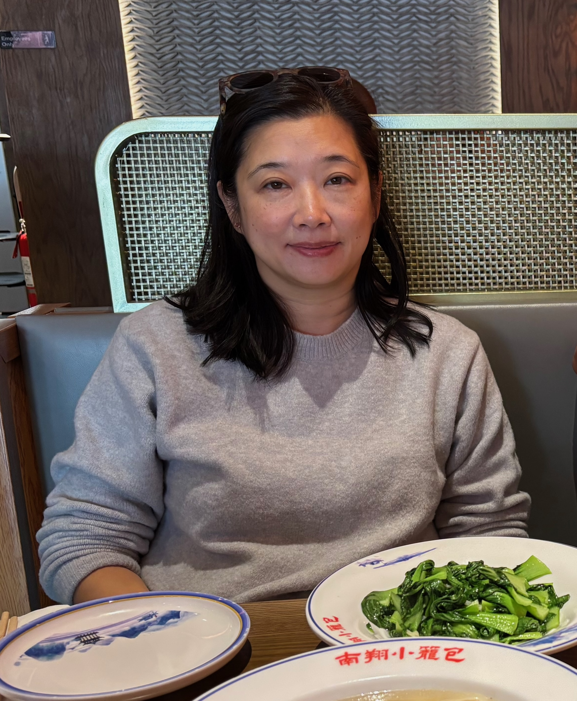

+++
date = '2025-02-18T11:49:46-07:00'
draft = false
title = 'La Famille de Kim'
# weight = 0
+++

Voici moi, Rafael Kim, et j’ai quatorze ans. Je suis grand et mince, et j’ai cheveux raides noirs, et yeux marrons. Je suis sympa, sociable, musical, paresseux, et réfléchi.

Voici Sung Mee Kim, elle a quarante-huit ans, et c’est ma mère! Elle est petite et belle, et elle a cheveux longs noirs et yeux marrons. Elle est intelligente, calme, sympa, sociable, et attentionnée.

Voici Peter Kim, il a quarante-six ans, et c’est mon père. Il est grand et fort, et il a cheveux courts noirs et yeux marrons. Il est intelligente, sociable, occupé et attentionné mais il est rude quelquefois.

Voici Mateo Kim, il a douze ans, et c’est mon frère. Il est petit, et sa tête est rond. Il a cheveux courts noirs et yeux marrons. Il est sociable et énergique, mais aussi bruyant, rude, et naïf.

Voici Tina Kim, elle a quarante-quatre ans, et c’est ma tante. Elle est petite et mince. Elle a cheveux longs noirs, et yeux marrons. Elle est calme, sociable, attentionnée, mais est occupée et naïf.

Voici Julius Kim, il a cinquante-et-un ans, et c’est mon oncle. Il est grand et fort, et il a yeux marrons et cheveux courts noirs. Il est calme, attentionné, reconnaissant, et heureux mais est très occupé.

Voici Joanne Kim, elle a soixante-huit ans, et c’est ma grande-mère. Elle est petite et belle, et elle a cheveux courts gris et yeux marrons. Elle est sociable, attentionnée, énergique, heureuse, et reconnaissante.

Voici Paul Kim, il a soixante-dix-sept, et c’est mon grand-père. Il est fort et il a un visage long, cheveux courts gris, et yeux marrons. Il est naïf, attentionné, grincheux, commandant, et il aime regarder la télé.

Voici Jesse Heikkinen, il a vingt-cinq ans, et c’est mon cousin au second degré. Il est grand et très fort, et il a cheveux courts noirs et yeux marrons. Il est sympa, sociable, attentionné, travailler dur, et très occupé. 

Voici Sarah Kim, elle a vingt-neuf ans, et c’est ma cousine germain une fois éloignée. Elle est petite et belle, et elle a cheveux longs noirs et yeux marrons. Elle est sociable, attentionnée, créative, artistique, mais est très occupé.

Voici Springsteen, il a cinq ans, et c’est mon chien. Il est petit et mignon, et il a cheveux courts gris, et yeux marrons. Il est calme, énergique, heureux, bon, et naïf.